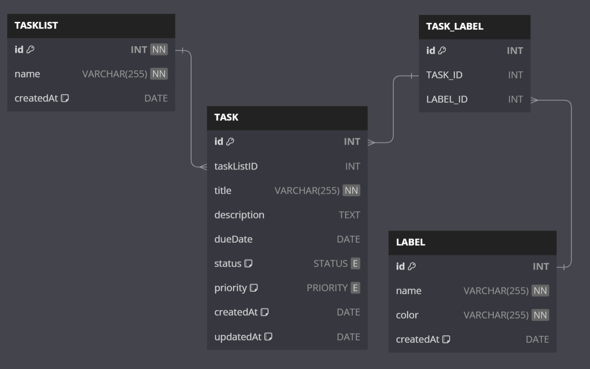

# Todolist Application with Spring Boot


This is a simple Todolist application built with Spring Boot. It allows users to create, manage, and organize their tasks and to-do lists.

## Features

- Create, Read, Update, and Delete tasks.
- Organize tasks into different lists.
- Mark tasks as completed or pending.
- Set due dates for tasks.

## Prerequisites

Before you begin, ensure you have met the following requirements:

- Java 17 or higher installed.
- Maven for building the project.
- An IDE (Eclipse, IntelliJ IDEA, VSCode, etc.) or a code editor of your choice. Personally, I use VSCode.
- [Spring Boot](https://spring.io/projects/spring-boot) knowledge.

## Getting Started

To get started with this project, follow these steps:

### 1. Clone the repository:

```bash
git clone https://github.com/Macktireh/SpringBootTodolist.git todolist
```

### 2. Navigate to the project directory:

```bash
cd todolist
```

### 3. Build the project using Maven:

```bash
mvn clean install
```

### 4. Create Database:

if docker and docker-compose is installed on your computer, execute the following command. If not, install docker to run the command or install a relational database (PostgreSQL, MySQL ...etc).

```bash
docker-compose up -d
```

### 5. Run the application:

```bash
mvn spring-boot:run
```

### 6. Open your web browser and access the application at http://localhost:8080.

## Data Models

### Database Schema



The application uses a database to store task-related information. Below is the schema of the database used in the Todolist application:

#### TaskList

- `id`: A unique identifier for the task list.
- `name`: The name of the task list.
- `createdAt`: The date when the task list was created.

#### Task

- `id`: A unique identifier for the task.
- `taskListID`: A reference to the task list to which the task belongs.
- `title`: The title or name of the task.
- `description`: A textual description of the task.
- `dueDate`: An optional due date for the task.
- `status`: The status of the task, which can be `OPEN`, `IN_PROGRESS`, or `COMPLETED`.
- `priority`: The priority of the task, which can be `LOW`, `MEDIUM`, or `HIGH`.
- `createdAt`: The date when the task was created.
- `updatedAt`: The date when the task was last updated.

#### Label

- `id`: A unique identifier for the label.
- `name`: The name of the label.
- `color`: The color associated with the label.
- `createdAt`: The date when the label was created.

#### Task_Label

This is a join table that links tasks to labels. It contains two foreign keys, `TASK_ID` and `LABEL_ID`, to create a many-to-many relationship between tasks and labels.

You can use this schema as a reference to understand how data is structured in the database for the Todolist application.

### Enums

The application also uses two ENUM types: `PRIORITY` and `STATUS`.

- `PRIORITY`: Represents the priority levels of tasks (`LOW`, `MEDIUM`, `HIGH`).
- `STATUS`: Represents the status of tasks (`OPEN`, `IN_PROGRESS`, `COMPLETED`).

These ENUM types are used to define valid values for the priority and status fields in the Task table.

## Configuration

You can configure the application by modifying the application.properties file. You may need to set up a database connection and other properties as per your requirements.

## License

This project is licensed under the MIT License - see the LICENSE file for details.